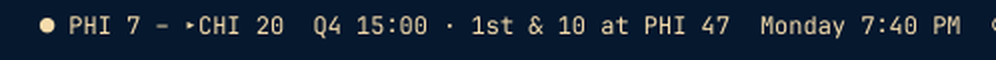

# Sports Ticker for Omarchy

Live scores in your bar. Games flip through one at a time with the inning,
quarter or period and time left, and football shows possession, down, distance
and yard line. Click the ticker to choose your sports, show only today's games,
and set how long each score stays up.

```
● PHI 7 – ▸CHI 20  Q4 9:41 · 2nd & 7 at CHI 45
● NYY 3 – BOS 2  Top 7th
● BOS 1 – NYR 0  P2 8:31
  PHI @ ATL  Tue 11:00am
  MTL 2 – TOR 4  Final
```



Scores come from ESPN's public scoreboard. No account or API key is needed.

## Install

Requires **Omarchy's Quickshell shell/plugin system** and **Python 3**
(standard library only). Older Omarchy installations using Waybar are not
supported.

Install and enable the plugin:

```bash
omarchy plugin add https://github.com/nwohater/SportsTicker-Omarchy.git --enable
```

The installer lets you choose a bar section. Sports Ticker defaults to the
center. Move it any time:

```bash
omarchy bar move io.github.nwohater.sportsticker --section right
```

Use `left`, `center`, or `right`.

## Use

| Control | Action |
| --- | --- |
| Left-click | Open the settings window |
| Right-click | Skip to the next game |
| Middle-click | Refresh scores now |
| Hover | Tooltip with the full matchup and game count |

### Settings

Click the ticker to open the settings window (drag its title strip to move it;
close with **×** or Escape). Changes apply immediately.

- **Sports**: check or uncheck NFL, College Football, NBA, WNBA, College
  Basketball (M), MLB, NHL, MLS, Premier League, La Liga, Bundesliga, Serie A,
  and Champions League.
- **Today's games only**: show only games that start today, plus any game still
  in progress. Turn it off to see yesterday through tomorrow. On a Monday night
  in football season, this is just the one game.
- **Seconds per game**: how long each score stays up before flipping to the
  next, from 2 to 120.

Settings are saved to `~/.config/sports-ticker/settings.json`, which you can
also edit by hand:

```json
{
  "leagues": ["football/nfl", "baseball/mlb"],
  "todayOnly": true,
  "seconds": 6
}
```

Leagues use ESPN's `sport/league` names, for example `hockey/nhl` or
`soccer/eng.1`.

### What you see

- Live games come first, marked with **●**, then upcoming games, then finals.
- Baseball shows the inning (`Top 7th`); basketball and football show the
  quarter and clock (`Q3 2:33`); hockey shows the period (`P2 8:31`); soccer
  shows the match minute. Overtime and halftime are shown as such.
- Football adds **▸** next to the team with the ball, the down and distance with
  the spot (`2nd & 7 at CHI 45`), and `RZ` in the red zone.
- Upcoming games show their local start time, with the weekday when not today.
- The text uses your bar's normal font size and theme foreground color.

Scores refresh every 30 seconds while any game is live and every 5 minutes
otherwise.

## Update

```bash
omarchy plugin update io.github.nwohater.sportsticker
omarchy restart shell
```

A plugin rescan normally reloads the UI:

```bash
omarchy-shell shell rescanPlugins
```

If edited QML still shows its old appearance, use `omarchy restart shell` to
clear retained components. The bar briefly disappears.

## Develop from a checkout

```bash
git clone git@github.com:nwohater/SportsTicker-Omarchy.git
ln -s "$PWD/SportsTicker-Omarchy" ~/.config/omarchy/plugins/io.github.nwohater.sportsticker
omarchy plugin enable io.github.nwohater.sportsticker --section center
omarchy restart shell
```

Keep the checkout in place. Edits to `sports-fetch` take effect on the next
poll; QML edits need `omarchy restart shell`. To try the fetcher on its own:

```bash
./sports-fetch baseball/mlb hockey/nhl          # all games, yesterday to tomorrow
./sports-fetch --today football/nfl | jq .
```

### Implementation

- `Widget.qml`: bar widget, rotation timers, and the settings window.
- `sports-fetch`: fetches ESPN scoreboards in parallel, formats each game, sorts
  live/upcoming/final, and prints JSON.
- `manifest.json`: plugin metadata.

## Notes

- ESPN's scoreboard endpoints are unofficial and undocumented. They have been
  stable for years but can change without notice.
- The plugin only reads public scoreboard data and stores nothing but the
  settings file above.

## Remove

```bash
omarchy plugin remove io.github.nwohater.sportsticker
```

Your settings file at `~/.config/sports-ticker/` is left in place.

## License

MIT — see [LICENSE](LICENSE).
